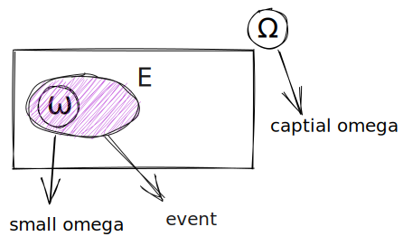
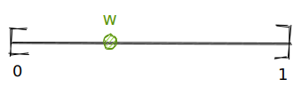

# Probability and Statistics

## 1-Introduction to probability and statistics

### 1-1-Probability & Space

- **Sample space**: Set of all possible outcomes in an experiment.

  - 
  - The box with an superscript of $\Omega$ (capital letter of $\omega$) in represented in the diagram refers to the **sample space**.
  - The small omega inside the sample space represents the realization of the event.

- **Event**: The event is a subset of the sample space, represented using shaded purple with $E$ superscript on top.

## 1-2 Random Valuables

> **Example 1 (discrete)**: Toss two dices, one is red and one is white and record the outcome.
>
> - 
> - $\Omega=\{(i, j):i=1,2, \ldots, 6, j=1,2, \ldots, 6\}$
>   - The $:$ colon sign indicates **such that**
>   - $\Omega$ refers to the sample space, whereas $(i,j)$ refers to the two realization the event will attain, the white dice and the red dice, for $i=1,2,\ldots,6$ and $j=1,2,\ldots,6$ refers to the out comes in each.
> - There are 36 outcomes in this scenario, by which $6 \times 6=36(\mathrm{outcomes})$
> 
> **Extension**: $E=\{ (i , j): i+j=7 \}$, what's the probability of this event.
> - $P(E)=\dfrac{|E|}{|\Omega|}=\dfrac{6}{36}=\dfrac{1}{6}$, this is true if the dices are **fair** and independent.
>   - The $\color{red}{|}\ldots\color{red}{|}$ the bars marked in red in this scenario means the **total number inside the event $E$**.
- Discrete: The number of outcomes in the sample space is finitely many, and infinitely many. (Basically **countable**, where we can count)

> **Example 2 (continuous)**: Throw a dart on to the interval $[0,1]$ and we observe the point of impact.
> - $\Omega=[0,1]$, between this interval we have **infinity** many numbers which we cannot count them.
> - 
>   - what is $P\{w\}$, where $w=0.34877\ldots$, $P\{w\}=0$, since **there are unaccountably many indefinitely many elements in this sample space, the probability of this one is $0$.**
> - if $E=(0.2,0.8)$, what is $P(E)$?
>   - Since this is a continuous example, between the interval $(0.2,0.8)$ will have infinitely many solutions, where the probability will be calculated by $P(E)=\dfrac{|E|}{|\Omega|}=\dfrac{}{}$