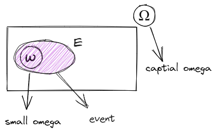
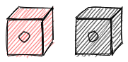
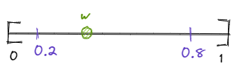
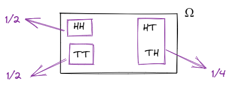
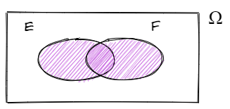
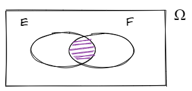
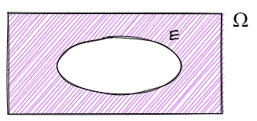
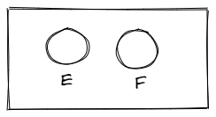
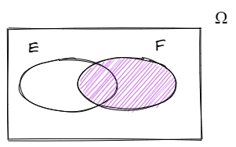
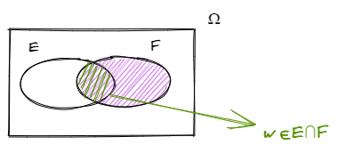

# Probability and Statistics

## 1-Introduction to probability and statistics

### 1-1-Probability & Space

- **Sample space**: Set of all possible outcomes in an experiment.

  - 
  - The box with an superscript of $\Omega$ (capital letter of $\omega$) in represented in the diagram refers to the **sample space**.
  - The small omega inside the sample space represents the realization of the event.

- **Event**: The event is a subset of the sample space, represented using shaded purple with $E$ superscript on top.

### 1-2 Random Valuables

> **Example 1 (discrete)**: Toss two dices, one is red and one is white and record the outcome.
> - 
> - $\Omega=\{(i, j):i=1,2, \ldots, 6, j=1,2, \ldots, 6\}$
>   - The $:$ colon sign indicates **such that**
>   - $\Omega$ refers to the sample space, whereas $(i,j)$ refers to the two realization the event will attain, the white dice and the red dice, for $i=1,2,\ldots,6$ and $j=1,2,\ldots,6$ refers to the out comes in each.
> - There are 36 outcomes in this scenario, by which $6 \times 6=36(\mathrm{outcomes})$
> 
> **Extension**: $E=\{ (i , j): i+j=7 \}$, what's the probability of this event.
> - $P(E)=\dfrac{|E|}{|\Omega|}=\dfrac{6}{36}=\dfrac{1}{6}$, this is true if the dices are **fair** and independent.
>   - The $\color{red}{|}\ldots\color{red}{|}$ the bars marked in red in this scenario means the **total number inside the event $E$**.
- Discrete: The number of outcomes in the sample space is finitely many, and infinitely many. (Basically **countable**, where we can count)

> **Example 2 (continuous)**: Throw a dart on to the interval $[0,1]$ and we observe the point of impact.
> - $\Omega=[0,1]$, between this interval we have **infinity** many numbers which we cannot count them.
> - 
>   - what is $P\{w\}$, where $w=0.34877\ldots$, $P\{w\}=0$, since **there are unaccountably many indefinitely many elements in this sample space, the probability of this one is $0$.**
> - if $E=(0.2,0.8)$, what is $P(E)$?
>   - Since this is a continuous example, between the interval $(0.2,0.8)$ will have infinitely many solutions, where the probability will be calculated by $P(E)=\dfrac{|E|}{|\Omega|}=\dfrac{\infty}{\infty}$, **BUT this is not true!**.
> - which it's going to be computed by the following, $\frac{\operatorname{LENGTH}(E)}{\operatorname{LENGTH}(\Omega)}=\frac{0.8-0.2}{1}=\frac{0.6}{1}=0.6$, where using the interval presented in the event $E \in (0.2 ,0.8)$ divide by the total length of the event $E=1$ in order to get the final $P$ probability results. (graphing presented above).
>   - This is **ONLY** true when the event is statically uniform.

- A lot of probability theories is based on the **measure theory**.

### 1-3-Axioms of Probability

- Axiom: To each event $E$ we associate a number $P(E)$ called the **probability of $E$** such that,

  - $0\leq P(E) \leq 1$
  
  - Countable activity :If $E_{1}, E_{2}, E_{3}, \ldots$ (a collection of events/infinite convection events) are **disjoint**, then, this also refers to the.
    - Disjoint is also represented by "mutually exclusive".
    
    - If $E,F$ are disjoint, then $E \cap F=\phi$ .
  
      $$
      P\left(\bigcup_{i} E_{i}\right)=\sum_{i} P\left(E_{i}\right)
      $$

      - The formula indicates the probability of a union of a event is equal to the sum of the probability of the events.

      $$
      P\left(E_{1} \cup E_{2} \cup E_{3} \cup \ldots\right)=P\left(E_{1}\right)+P\left(E_{2}\right)+\ldots
      $$

  - It follows the entire sample space $P(\Omega)=1$ is equal to $1$.

> **Example 3**: Flip two fair coins, $P(E)$?
> - 2 Heads, $\frac{1}{4}$
> - 2 Tails, $\frac{1}{4}$
> - 1 Head & 1 Tail, $\frac{1}{2}$
> - The sample space $\Omega$ is presented in the following diagram with 4 possible outcomes,
>   - 

### 1-4-Set Theory

If we are dealing two events $E\&F$, see the following scenarios applying to the set theory,
- 
  - $E \cup F=\{\omega \in \Omega: \omega \in E \text{ or } \omega \in F\}$

- 
  - $E \cap F=\{\omega \in \Omega: \omega \in E \text{ and } \omega \in F\}$

- 
  - $E^{c}=\Omega \backslash E = \{\Omega\in E: \omega \notin E\}$

- **Property 1**: If we take the compliment of the two sets, then,

$$
\left\{\begin{array}{l}
(E \cup F)^{c}=E^{c}\cap F^{c} \\
(E \cap F)^{c}=E^{c}\cup F^{c} 
\end{array}\right.
$$

- **Property 2**: If we are dealing with a partition such, $\left\{F_{1}, F_{2}, F_{3}, \ldots\right\}$ of the sample space $\Omega$, then the following is,
  - Partition: The Partition Values are the measures used in statistics for dividing the total number of observations of a distribution into certain number of equal parts.

$$
\begin{aligned}
E &=\bigcup_{i}\left(E \cap F_{i}\right) \\
& =\left(E \cap F_{1}\right) \cup\left(E \cap F_{2}\right) \cup\left(E \cap F_{3}\right) \cup
\end{aligned}
$$

### 1-5-Independence

If $E$ and $F$ are independent, then,

$$P(E \cap F)=P(E) \cdot P(F)
$$

> **Example 4**: Two events are presented by $E\&F$, represented in the diagram follow, are they independent?
> - 
> 
> The answer is **not necessarily indeed**, if the intersection of the two event is empty or zero, the event is not independent.
> - $E \cap E=\phi \Rightarrow P(E \cap F)=P(\phi)=0$, conclude that $P(E)\cdot P(F)$ is not necessarily independent.

### 1-6-Conditional Probabilities

- The conditional probability is conditional probability is a measure of the probability of an event occurring, given that another event has already occurred, also defined mathematically as follow,
  - $P(E|F)$ indicates $E$ is **given by $F$**.

$$
P(E \mid F)= \begin{cases}P(E \cup F) & \text { if } \quad P(F)>0 \\ \text { undefined } & \text { if } \quad P(F)=0\end{cases}
$$

> **Example 5**: Suppose we know that event $F$ has occurred $(w \in E)$ as represented in the following diagram,
> - 
> 
> Then the event $E$ **can only occur** if $\omega \in E \cap F$, as represented in the diagram follow,
> - 

- If $0 \leq P(E|F) \leq 1$, then it satisfy the following,

$$
\operatorname{P}\left(\bigcup_{i} E_{i} \mid F\right)=\sum_{i} P(E_{i} \mid F)
$$

> **Example 7**: What is the statement opposite to "nothing happens"?
> 
> The answer is "something happens".

- Nothing happens: $\bigcap_{i}E_{i}^{c}$
- Nothing is true (opposite): $\left(\bigcap_{i} E_{i}^{c}\right)^{c}=\bigcup_{i}\left(E_{i}^{c}\right)^{c}=\bigcup_{i} E_{i}$
  - $\bigcap_{i}$ indicates "at least".
  - $\bigcap_{i}$ indicates "all of it".
  - $\bigcup_{i}$ indicates "some of it".
  - $\bigcap_{i} E_{i}$ indicates "everything happens".

> **Example 7**: Blood test is 95% effective if a person has a disease
> - A false positive occurs with probability 1%
> 
> Then what is the probability that a person has the disease given that the test is positive?
> 